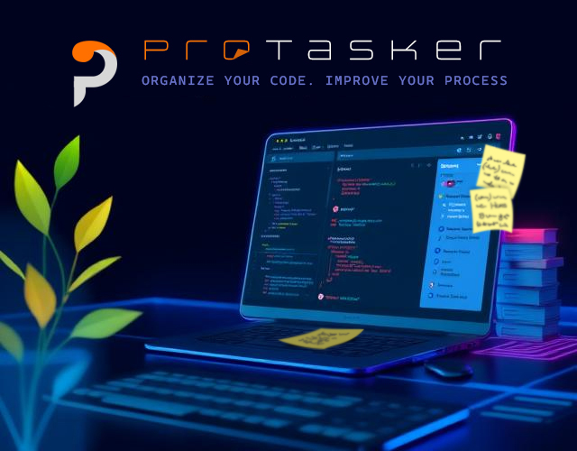

# 📌 ProTasker – VS Code Extension

**ProTasker** is a powerful VS Code extension designed for managing notes, tasks, comments, and events within your code. It helps you organize your workflow, track code changes, and manage your work processes directly from the editor.



## 🚀 Features

- ✅ **Create and manage notes** in code, files, and folders.
- ✅ **Add comments** to specific lines of code.
- ✅ **Create checklists** to organize tasks.
- ✅ **Log events** related to files and projects.
- ✅ **Structured tree view** of all records in the side panel.
- ✅ **Search & filter notes** by keywords.
- ✅ Flexible data storage in **JSON format**.
- ✅ **Icons and context menus** for seamless navigation.
- ✅ **Localization support** (English, Russian, Ukrainian).
- ✅ **User settings** for custom record types, color schemes, and UI behavior.

## 📥 Installation

### 📌 1. Install from Marketplace (Coming Soon)
1. Open **VS Code**.
2. Go to **Extensions** (`Ctrl+Shift+X`).
3. Search for **ProTasker**.
4. Click **Install**.

The extension is ready to use!

### 📌 2. Manual Installation (From Source Code)
1. Clone the repository:

   ```bash
   git clone https://github.com/taras711/ProTasker.git
   ```

2. Navigate to the project folder:

   ```bash
   cd ProTasker
   ```

3. Install dependencies:

   ```bash
   npm install
   ```

4. Launch the extension in **VS Code**:

   ```bash
   code .
   ```

5. Press **F5** to start in development mode.

## 📖 How to Use?

### 🔹 Creating Notes, Comments, or Checklists
1. Right-click in your code.
2. Select **"Note Action"** in context menu
3. Choose **"Add Note / Comment / Checklist ..."**.
4. Enter the text and save it.

### 🔹 Viewing All Entries
1. Open the **ProTasker side panel**.
2. See all notes, comments, and checklists organized in a tree structure.

### 🔹 Filtering & Searching
1. Use the search bar to find specific records.
2. Filter entries by type (**note**, **comment**, **checklist**, **event**).

### 🔹 Working with Checklists
1. Create a checklist from the context menu.
2. Each checklist contains tasks that can be marked as completed.
3. Track progress easily from the **ProTasker panel**.

## 📸 Screenshots


 

## ⚙️ Settings & Configuration

The settings file can be found in **settings.json**:

```json
{
  "protasker.language": "en",
  "protasker.showPinned": true,
  "protasker.noteIcon": "📌"
}
```

### Available Options:

- `"language"` – Select language (**"en"**, **"es"**, **"uk"**, **"fr"**, ...).
- `"showPinned"` – Show pinned notes (**true/false**).
- `"noteIcon"` – Choose an icon for notes.

## 🛠 Development & Contributions

Want to contribute? Follow these steps:

1. Fork the repository.
2. Create a new branch:

   ```bash
   git checkout -b feature-branch
   ```

3. Make changes and commit:

   ```bash
   git commit -m "Description of changes"
   ```

4. Submit a **pull request**.

## 📌 Roadmap

- ✔ Integration with **cloud services**.
- ✔ Advanced **UI settings**.
- ✔ **Cross-device sync** support.
- ✔ **Widgets** on the VS Code home screen.

## 📜 License

This project is licensed under the [LICENSE](./LICENSE). See the full license in the **LICENSE** file.

## 👥 Authors & Acknowledgments

**Main Developer**: [Taras711](https://github.com/taras711)

### Special Thanks:
- **VS Code API** – For providing an excellent platform.
- **Open Source Community** – For contributions and support.
```
